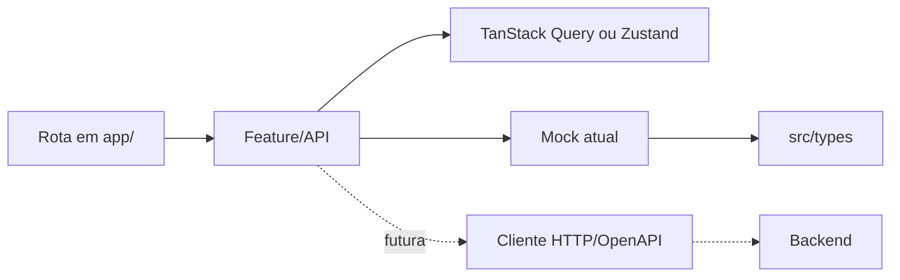

# Arquitetura do RookHub Mobile

## Objetivo

Este repositório entrega exclusivamente o aplicativo nativo do motorista para iOS e Android. O
painel administrativo e o site institucional são produtos separados, respectivamente em
`../System-web` e `../Website`.

O aplicativo está na fase de MVP navegável. As telas e regras principais funcionam com dados
simulados atrás de contratos, preparando a troca futura por uma API sem acoplar a interface aos
mocks.

## Stack

- Expo SDK 54 e React Native 0.81.
- React 19 e expo-router 6.
- TypeScript estrito.
- TanStack Query para estado assíncrono.
- Zustand para estado local/global e sessão.
- React Hook Form e Zod para formulários e validação.
- Secure Store para persistência do token.
- Reanimated e Worklets para animações nativas compatíveis.

O projeto utiliza npm e um único `package-lock.json`. Não existe workspace, pnpm ou Turborepo.

## Organização

```text
System-mobile/
├── app/                         # Rotas do expo-router
│   ├── (tabs)/                  # Navegação principal
│   ├── viagem/[id].tsx          # Detalhe da viagem
│   ├── checklist.tsx
│   ├── login.tsx
│   └── _layout.tsx              # Providers e decisão de sessão
├── src/
│   ├── components/ui/           # Primitivos visuais nativos
│   ├── features/                # Módulos por domínio
│   ├── lib/                     # Funções puras e formatação
│   ├── mocks/                   # Dados e implementações simuladas
│   ├── theme/                   # Tokens de design do mobile
│   └── types/                   # Contratos de domínio
├── assets/                      # Ícones, splash e marca
├── docs/
├── app.json
├── babel.config.js
├── metro.config.js
├── package.json
└── tsconfig.json
```

Cada feature mantém próximos seus contratos, schema, estado e componentes específicos. As rotas
ficam em `app/` porque o expo-router usa roteamento por arquivo.

## Fluxo de dados



Uma tela nunca importa `src/mocks` diretamente. A implementação simulada fica atrás do arquivo
`api.ts` da feature. Quando a API real entrar, a implementação muda sem alterar a composição das
telas.

## Navegação e sessão

O layout raiz monta os providers e aguarda a hidratação da sessão. O token é armazenado no keychain
do sistema por `expo-secure-store`. A decisão entre login e área autenticada só ocorre depois de
`useHydrated()`, evitando uma troca visual indevida durante a abertura.

As proteções atuais são de experiência do usuário. O backend deverá validar autenticação,
autorização e todas as regras sensíveis.

## Interface e acessibilidade de campo

- Tema escuro e tokens centralizados em `src/theme`.
- Primitivos nativos compartilhados em `src/components/ui`.
- Alvos de toque com pelo menos 48pt.
- Feedback de carregamento, vazio e erro por `StateView`.
- Sem componentes DOM, Tailwind ou efeitos de blur caros por item de lista.

O visual existente é parte do produto e não deve mudar em reorganizações estruturais.

## Configuração nativa

- iOS e Android são os alvos de produto; `web` é apenas o preview de desenvolvimento do mesmo
  app, servido pelo Metro.
- Bundle iOS e package Android: `com.rookhub.driver`.
- Scheme: `rookhub`.
- Nova arquitetura do React Native habilitada.
- Câmera permitida para fotos de checklist e abastecimento.
- Microfone desabilitado no Image Picker porque o produto não grava áudio.
- Tablet iOS fora do escopo atual.
- O mapa da rota é uma implementação só, em
  [`route-map-canvas.tsx`](../src/features/journey/components/route-map-canvas.tsx): tiles raster
  sobre `Image` e traçado em `react-native-svg`, sem variante `.native` nem `.web`. Android, iOS e
  preview desenham o mesmo pixel.

Como o quadro é estático — o motorista navega pelo aplicativo dele, no botão “Abrir rota” — não há
mapa nativo interativo e nenhuma chave do Google Maps é necessária para o binário. Os tiles vêm do
basemap público do CARTO sobre dados do OpenStreetMap, com a atribuição desenhada dentro do quadro;
antes de publicar nas lojas, confirmar o plano de uso do provedor de tiles.

Dependências nativas devem ser adicionadas preferencialmente com `npx expo install`, que escolhe a
versão compatível com o SDK. Dependências referenciadas diretamente pela configuração, como
`babel-preset-expo`, e peers nativos como `expo-font` e `react-native-worklets` também precisam ser
declarados diretamente.

## TypeScript e Babel

O `tsconfig.json` estende `expo/tsconfig.base.json`, mantém regras estritas e define `@/*` para
`src/*`. Não se usa `baseUrl`.

O Babel usa somente `babel-preset-expo`. No SDK atual, o preset detecta Reanimated/Worklets e inclui
o plugin necessário; registrar o plugin novamente no `babel.config.js` é redundante. A opção
`unstable_transformImportMeta` fica ligada porque o Zustand lê `import.meta.env.MODE` e o Metro
serve o preview web como script clássico.

O `metro.config.js` existe por um motivo só: a chave de cache do Metro não considera o
`babel.config.js`, então mudar o preset e reiniciar o servidor continuava entregando código
transformado pela configuração anterior. `cacheVersion` passa a ser o hash do arquivo do Babel, e a
invalidação acontece sozinha — sem `--clear`.

## Qualidade e validação

Antes de fechar uma alteração:

```bash
npm install
npm run validate
npm run export:android
npm run export:ios
```

`validate` executa TypeScript, Prettier, compatibilidade das dependências Expo e Expo Doctor. Os
exports confirmam que o Metro consegue resolver e empacotar o código das duas plataformas.

Ainda não há ESLint nem testes automatizados. Até serem implementados, toda alteração de interface
também precisa de teste manual em dispositivo ou emulador, incluindo login, tabs, viagem,
checklist, abastecimento e persistência de sessão.

## Evolução prevista

1. Definir OpenAPI e substituir as implementações mock por cliente HTTP.
2. Adicionar autenticação e autorização reais no backend.
3. Introduzir testes unitários, de componentes e de fluxos críticos.
4. Configurar ESLint, CI e builds assinados para as lojas.
5. Integrar telemetria e tratamento centralizado de falhas.
